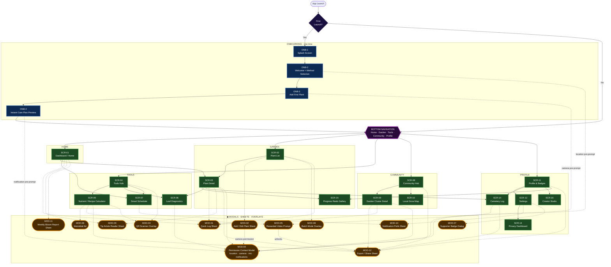

# GardenPulse — Navigation Sitemap

**Total Items: 32**

- 4 Onboarding Screens (ONB-1 → ONB-4)
- 16 Main App Screens (SCR-01 → SCR-16)
- 12 Modals / Sheets / Overlays (MOD-01 → MOD-12)

---

## Legend

| Symbol                 | Meaning                        |
| ---------------------- | ------------------------------ |
| Rectangle (green)      | Full App Screen                |
| Pill / Stadium (amber) | Modal · Bottom Sheet · Overlay |
| Rectangle (blue)       | Onboarding Screen              |
| `-->` solid arrow      | Screen-level navigation        |
| `-.->` dashed arrow    | Modal / overlay trigger        |
| Hexagon (purple)       | Always-visible navigation hub  |

---

---

## Screen Index

### Onboarding

| ID    | Screen                     |
| ----- | -------------------------- |
| ONB-1 | Splash Screen              |
| ONB-2 | Welcome + Method Selection |
| ONB-3 | Add First Plant            |
| ONB-4 | Instant Care Plan Preview  |

### Main App Screens

| ID     | Screen                       | Tab              |
| ------ | ---------------------------- | ---------------- |
| SCR-01 | Dashboard / Home             | Home             |
| SCR-02 | Plant List                   | Garden           |
| SCR-03 | Plant Detail                 | Garden           |
| SCR-04 | Tools Hub                    | Tools            |
| SCR-05 | Nutrient / Recipe Calculator | Tools            |
| SCR-06 | Leaf Diagnostics             | Tools            |
| SCR-07 | Smart Scheduler              | Tools            |
| SCR-08 | Community Hub                | Community        |
| SCR-09 | Garden Cluster Detail        | Community        |
| SCR-10 | Local Grow Map               | Community        |
| SCR-11 | Profile & Badges             | Profile          |
| SCR-12 | Settings                     | Profile          |
| SCR-13 | Privacy Dashboard            | Profile          |
| SCR-14 | Cemetery Log                 | Profile          |
| SCR-15 | Progress Reels Gallery       | Profile / Garden |
| SCR-16 | Creator Studio               | Profile          |

### Modals / Sheets / Overlays

| ID     | Modal                     | Primary Trigger                                                                                                                                 |
| ------ | ------------------------- | ----------------------------------------------------------------------------------------------------------------------------------------------- |
| MOD-01 | Quick Log Sheet           | Dashboard FAB · Plant List FAB · Plant Detail FAB · Community challenge submit                                                                  |
| MOD-02 | Add / Edit Plant Sheet    | Plant List (+) · Onboarding (ONB-3) · Plant Detail (Edit)                                                                                       |
| MOD-03 | QR Scanner Overlay        | Tools Hub · Calculator "Scan label"                                                                                                             |
| MOD-04 | Permission Context Modal  | ONB-2 (location) · ONB-3 (camera) · ONB-4 (notifications) · Leaf Diagnostics (camera) · Plant Detail notes (mic) · Cluster Detail post (camera) |
| MOD-05 | Rewarded Video Prompt     | Calculator export · Reels download · Cemetery Log export                                                                                        |
| MOD-06 | Interstitial Ad           | Calculator "Generate Recipe"                                                                                                                    |
| MOD-07 | Supporter Badge Dialog    | Settings · Profile banner                                                                                                                       |
| MOD-08 | Batch Mode Overlay        | Plant List (batch toggle)                                                                                                                       |
| MOD-09 | Tip Article Reader Sheet  | Dashboard tip card · Plant Detail tip card · Calculator tip link · Diagnostics results link                                                     |
| MOD-10 | Notification Prefs Sheet  | Settings · Smart Scheduler quick link                                                                                                           |
| MOD-11 | Weekly Bloom Report Sheet | Dashboard banner · Push notification (Monday morning)                                                                                           |
| MOD-12 | Export / Share Sheet      | Calculator · Plant Detail · Cluster Detail · Reels · Profile · Cemetery Log · Bloom Report · Community referral                                 |
