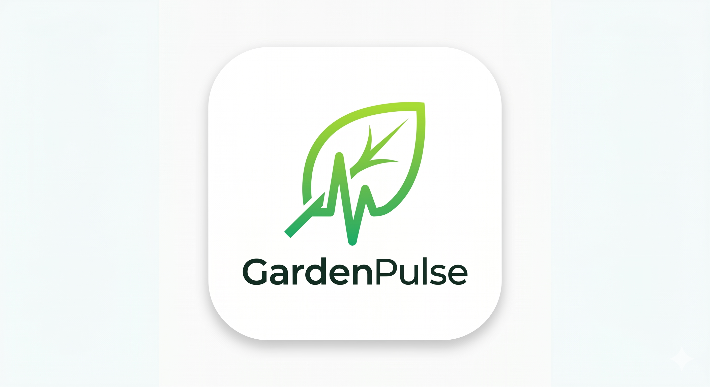

<p align="center">
  
</p>

<p align="center">
  
  
  
  
  
  
</p>

<h3 align="center">The first method-agnostic garden assistant - soil, hydro, container, or indoor - with location-aware intelligence, on-device AI diagnostics, and privacy-first automation.</h3>

---

##  What is GardenPulse?

**GardenPulse** is a smart urban garden companion that eliminates the guesswork out of growing. Whether you're tending windowsill herbs, managing a balcony container garden, running a hydroponic setup, or maintaining 50+ houseplants - GardenPulse adapts every recommendation to your specific growing method, your local climate, and your live weather conditions.

> **Tagline:** *Grow Smarter, Anywhere.*

Unlike generic plant apps, GardenPulse is **method-agnostic**: the entire UI, care schedule, and AI guidance adapts based on how *you* grow - not a one-size-fits-all template. Core tools are **100% free, forever**, with a privacy-first, offline-capable architecture.

---

##  Key Features

###  AI-Powered Intelligence
| Feature | Description |
|---|---|
| **Method-Agnostic Plant ID** | Snap a leaf → AI detects plant species, growing method, and likely issues (deficiency, pest, overwatering) |
| **Localized AI Agronomist** | On-device ML evaluates leaf patterns against user-logged metrics and regional climate data |
| **Smart Weather Integration** | Auto-adjusts care schedules based on live forecast (e.g., *"Rain tomorrow → skip watering today"*) |
| **Gemini Vision Diagnostics** | All leaf-scan diagnostics run on-device - photos are never uploaded to the cloud |

###  Location & Context Intelligence
| Feature | Description |
|---|---|
| **GPS / Network Location** | Enables hyper-local plant recommendations and regional pest/disease alerts |
| **Auto Planting Zone Detection** | USDA Hardiness Zone auto-detect filters the plant database to region-survivable species |
| **Live Weather API** | OpenWeatherMap One Call API 3.0 for real-time temp, humidity, precipitation, and UV index |
| **Local Community Maps** | Opt-in anonymized data shows what's thriving in your ZIP code right now |

###  Smart Scheduling & Automation
- **Adaptive Reminders** - Adjusts timing based on user behavior, live weather forecasts, and seasonal changes
- **Sunrise/Sunset Tracking** - Schedules grow-tent light cycles and outdoor watering relative to solar events
- **Timezone-Aware Engine** - Daylight saving auto-adjust included; travel-friendly reminder controls

###  Camera & Media Tools
- **Leaf Diagnostics Camera** - On-device AI analyzes discoloration without any cloud upload
- **Progress Timelapse Generator** - Auto-compiles photos into shareable growth reels with method-specific overlays
- **QR / Label Scanner** - Scan nutrient bottles, seed packets, or Bluetooth sensor IDs for auto-logging
- **Voice Logging** - Hands-free operation via microphone for users with mobility challenges

###  Analytics & Personalization
- **Garden Health Score™** - Tracks 8 metrics (soil moisture, light exposure, pH stability, growth rate) with plain-English insights
- **Adaptive Growing Profiles** - Toggle between *"Low-Light Apartment"*, *"Sunny Balcony"*, *"Hydro Tent"*, *"Raised Bed"*
- **Cross-Method Insights** - e.g., *"Your hydro basil grew 20% faster than soil → try adjusting nutrient strength"*
- **Cemetery Log** - Historical log of failed grows to identify root causes (pH spikes, root rot) over time

###  Monetization (AdMob Optimized)
| Ad Type | Trigger | Target eCPM |
|---|---|---|
| High-Intent Interstitial | Triggered at dosing calculation / export moments | $25–45 (Tier 1) |
| Contextual Native Ads | Styled as "Garden Tips" within the activity timeline | - |
| Rewarded Videos | Unlock PDF garden plans, compliance logs, advanced calculators | - |
| Supporter Badge | $2.99 one-time to remove interstitials only | - |

###  Community & Viral Features
- **Garden Clusters** - Join location or interest-based groups; share tips, swap seeds, compare progress
- **Growth Streaks + Method Badges** - Unlock *"Hydro Master"*, *"Balcony Boss"*, *"Zero-Waste Gardener"*
- **Shareable Progress Reels** - Auto-generated before/after timelapses and *"My Garden Setup"* infographics for Instagram/TikTok
- **Weekly Bloom Report** - Push/email digest with weather correlation, progress stats, and contextual tips

---

##  Technology Stack

| Layer | Technology | Version |
|:---|:---|:---|
| **Mobile Framework** | React Native + Expo | SDK `54.0.35` (RN `0.81.5`) |
| **Language** | TypeScript | `~5.9.2` |
| **UI Components** | React Native Paper (Material Design) | `^5.15.3` |
| **Glassmorphic UI** | @callstack/liquid-glass + expo-blur | `^0.8.0` / `~15.0.8` |
| **Icons** | @expo/vector-icons | `^15.0.3` |
| **Backend & Auth** | Firebase Auth, Firestore, Storage | `^12.14.0` |
| **AI Engine** | Google AI Studio - Gemini Multimodal & Vision | `^0.24.1` |
| **Location** | expo-location + Google Maps Platform | `~19.0.8` |
| **Maps** | react-native-maps | `1.20.1` |
| **Weather** | OpenWeatherMap One Call API 3.0 | - |
| **Camera** | expo-camera | `~17.0.10` |
| **Media** | expo-image-picker, expo-media-library | - |
| **Audio** | expo-av | `~16.0.8` |
| **Offline Storage** | @react-native-async-storage/async-storage | `2.2.0` |
| **State Management** | Zustand | `^5.0.14` |
| **Monetization** | Google AdMob (react-native-google-mobile-ads) | `^16.3.3` |
| **Vector Graphics** | react-native-svg | `15.12.1` |

---

##  Project Structure

```text
GardenPulse/
├── .agents/                  # Local AI agent skills (excluded from Git)
│   └── skills/               # Skillfish-managed agent skill packs
├── .claude/                  # Claude AI assistant context files
├── .docs/                    # Product blueprint & tech stack documents
│   └── Gardenpulse .md       # Full product specification
├── .expo/                    # Expo local build cache (auto-generated)
├── assets/                   # App icons, splash screens, banner assets
│   ├── banner-app-logo.png   # App banner (used in README)
│   ├── icon.png              # App icon (iOS)
│   ├── favicon.png           # Web favicon
│   ├── android-icon-foreground.png
│   ├── android-icon-background.png
│   └── android-icon-monochrome.png
├── App.tsx                   # Root application component
├── index.ts                  # Expo entry point
├── app.json                  # Expo config - permissions, plugins, AdMob IDs
├── metro.config.js           # Custom Metro bundler configuration
├── tsconfig.json             # TypeScript compiler settings
├── package.json              # Dependencies & npm scripts
├── INSTALL.md                # Detailed setup guide for all APIs & credentials
├── Architecture.drawio       # System architecture diagram
├── GARDENPULSE.md            # Product blueprint (markdown mirror)
├── AGENTS.md                 # Agent / AI assistant guidelines
├── CLAUDE.md                 # Claude assistant context
└── LICENSE                   # Proprietary License
```

---

##  Quick Start

### Prerequisites

Ensure the following are installed on your machine:

| Tool | Minimum Version | Notes |
|---|---|---|
| **Node.js** | `v18.x` or `v20.x` | LTS recommended |
| **npm** | `v9.x` or later | Bundled with Node |
| **Git** | Any recent version | For cloning |
| **Expo Go** | Latest | iOS / Android device app for development |
| **Android Studio** | Optional | For Android Emulator |
| **Xcode** | Optional (macOS only) | For iOS Simulator |

---

### 1. Clone & Install

```bash
git clone <repository-url>
cd GardenPulse
npm install
```

---

### 2. Configure Environment Variables

Create a `.env` file in the project root and populate it with your API keys:

```env
# ── Google AI Studio (Gemini) ───────────────────────────────
EXPO_PUBLIC_GEMINI_API_KEY=your_gemini_api_key_here

# ── OpenWeatherMap ──────────────────────────────────────────
EXPO_PUBLIC_OPENWEATHER_API_KEY=your_openweather_api_key_here

# ── Firebase ────────────────────────────────────────────────
EXPO_PUBLIC_FIREBASE_API_KEY=your_firebase_api_key_here
EXPO_PUBLIC_FIREBASE_AUTH_DOMAIN=your_project_id.firebaseapp.com
EXPO_PUBLIC_FIREBASE_PROJECT_ID=your_project_id
EXPO_PUBLIC_FIREBASE_STORAGE_BUCKET=your_project_id.appspot.com
EXPO_PUBLIC_FIREBASE_MESSAGING_SENDER_ID=your_messaging_sender_id
EXPO_PUBLIC_FIREBASE_APP_ID=your_firebase_app_id
EXPO_PUBLIC_FIREBASE_MEASUREMENT_ID=your_measurement_id
```

> **Note:** Google Maps API keys are embedded in `app.json` under the Android/iOS config sections. See [INSTALL.md](./INSTALL.md) for details.

---

### 3. Run the Development Server

```bash
npm run start       # Start Expo dev server (scan QR with Expo Go)
npm run android     # Launch on Android emulator / connected device
npm run ios         # Launch on iOS simulator (macOS only)
npm run web         # Launch web version in browser
```

Scan the QR code in the terminal with the **Expo Go** app on your physical device to preview the app instantly.

---

##  API Keys & Service Setup

| Service | Where to Get It | Docs |
|---|---|---|
| **Gemini AI** | [Google AI Studio](https://aistudio.google.com) | Free tier available |
| **OpenWeatherMap** | [openweathermap.org](https://openweathermap.org/api) | One Call API 3.0 |
| **Firebase** | [Firebase Console](https://console.firebase.google.com) | Auth + Firestore + Storage |
| **Google Maps** | [Google Cloud Console](https://console.cloud.google.com) | Maps SDK for Android/iOS |
| **AdMob** | [AdMob Console](https://admob.google.com) | Test IDs pre-configured |

> The project ships with **Google's standard AdMob test IDs** so you can build and test ads immediately without a real AdMob account.

---

##  Production Build (Google Play Store)

```bash
# 1. Install EAS CLI
npm install -g eas-cli

# 2. Log in to Expo
eas login

# 3. Configure EAS project (first time only)
eas build:configure

# 4. Build production Android App Bundle (.aab)
eas build --platform android --profile production
```

The `.aab` output is ready for direct upload to the **Google Play Console**.

For full deployment instructions including iOS App Store builds, keystore management, and AdMob production ID configuration, see [INSTALL.md](./INSTALL.md).

---

##  UX & Design Philosophy

- **Method-First Onboarding** - *"How do you grow?"* → app adapts its entire UI to soil / container / hydro / indoor
- **Instant Open** - Zero required registration; opens directly to the dashboard or calculator
- **Sleek, Borderless Layout** - Reduced visual noise using borderless card components, hairlineWidth accent borders, and optimized radius tokens
- **Glassmorphic Navigation** - A premium frosted bottom tab bar using `@callstack/liquid-glass` (Apple Liquid Glass) on iOS and `expo-blur` on Android
- **Adaptive Themes** - *"Balcony Bright"* (light) and *"Grow Tent Dark"* (low-light optimized) with matching glass tints and border values
- **Accessibility** - Full VoiceOver/TalkBack support, dyslexia-friendly font toggle, color-blind mode, metric/imperial auto-detect

---

##  Privacy & Compliance

GardenPulse is designed with a **privacy-first** architecture:

- ✅ All AI leaf diagnostics run **on-device** - no photos uploaded to the cloud
- ✅ Location data **never shared publicly** without explicit user opt-in
- ✅ GDPR / UK GDPR compliant - right-to-delete dashboard included
- ✅ CCPA / PIPEDA compliant - *"Do Not Sell My Info"* toggle in settings
- ✅ AdMob policies respected - no ads on permission screens; rewarded videos are always optional
- ✅ Offline-first caching - core app functions work without an internet connection

---

##  Roadmap

| Phase | Feature |
|---|---|
| **MVP** | Core logging, AI diagnostics, weather scheduling, AdMob |
| **Phase 2** | GardenPulse for Schools - STEM curriculum modules |
| **Phase 3** | Hardware integrations - Bluetooth sensors, smart irrigation |
| **Phase 4** | B2B white-label - Nurseries & seed brands |
| **Phase 5** | Certification pathways - Urban ag nonprofit partnerships |

---

##  Documentation

| Document | Description |
|---|---|
| [INSTALL.md](./INSTALL.md) | Full setup guide - API keys, Firebase config, AdMob IDs, Play Store deployment |
| [GARDENPULSE.md](./GARDENPULSE.md) | Complete product blueprint - features, UX flows, monetization model |
| [Architecture.drawio](./Architecture.drawio) | System architecture diagram (open with [draw.io](https://app.diagrams.net)) |

---

##  License

This project is proprietary and confidential. All rights are reserved. See the [LICENSE](./LICENSE) file for details.

---

<p align="center">
  Built with  by the GardenPulse team &nbsp;·&nbsp; <em>Grow Smarter, Anywhere.</em>
</p>
